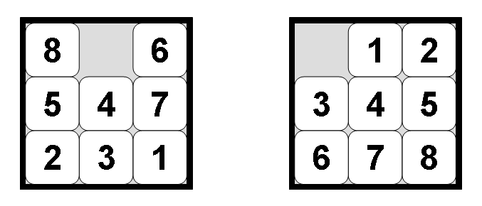

# Puzzle Solver

* Due: April 7, 2014
* Deliverables: slidingpuzzle.py

# Overview

You are creating a sliding puzzle solver for this assignment. This puzzle
consists of puzzle pieces on a grid. There is one missing piece, but you can
slide the pieces around to fill that gap. You will be given an initial state
for the puzzle and a goal state, and your solver will test all possible
strategies for solving the puzzle, and return a step by step process for
solving the puzzle.

# Specification

The template for your puzzle is in slidingpuzzle.py. There is a
BadMoveException object that can be raised when you tell a PuzzleState to slide
in a certain direction but it is illegal to do so. The PuzzleState class
contains the dimensions of the game board, current state of the game board, the
numbers in each tile, the parent game state from which this game state was
generated, and the move it took to get there.

For the initial game state, the parent can be set to None. There is a moveUp,
down, left, and right method that will return a new PuzzleState instance with
the pieces slid in the correct position. If it is an illegal move, this method
should raise a BadMoveException. The str function should return a human
readable representation of the grid that is two-dimensional, not a
one-dimensional list of integers. The eq function will be overriden to check if
the values in the PuzzleState match the values in another PuzzleState.

The PuzzleSolver has a constructor that takes a initial state and a goal state.
When the solve method is invoked, the breadth-first search algorithm will build
a game tree for all possible moves that can be made from that root.  A list of
visited PuzzleStates will be tracked in a list so that you do not get into an
infinite loop checking for the same moves. Once a PuzzleState is generated that
matches the goal, then the searching stage is complete. Now, backtrack to
generate the solution. Create a new array for the steps. Start with the goal
PuzzleState, and travel to the parent PuzzleState. Continue until the parent is
None, therefore you have found the initial state. Print the result.

# Tips

- Not every initial state can be traced to a solution; in fact, only half the possible combinations of initial state and final state can be solved by human or machine. This means if you want to test your own implementation without the tests, you should create initial states and solutions that you already know work. Otherwise, you'll be wondering why it's taking so long. For more information, see [this 1879 article][AJM] in the _American Journal of Mathematics._
- Make sure you use a flattened list to store the values, not a LinkedMatrix or something else crazy.
- Indexes are zero-indexed tuples in the form `(column, row)`.
- Don't be afraid to use helper functions! It's not at all a requirement, but Python's `@staticmethod` function decorator might help if you're feeling adventurous.
- Make sure you test for illegal moves and `raise BadMoveException` where applicable.

[AJM]: http://www.jstor.org/stable/2369492?origin=crossref
